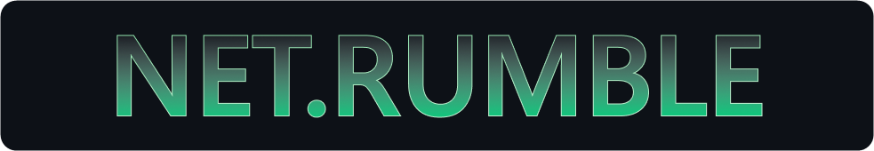
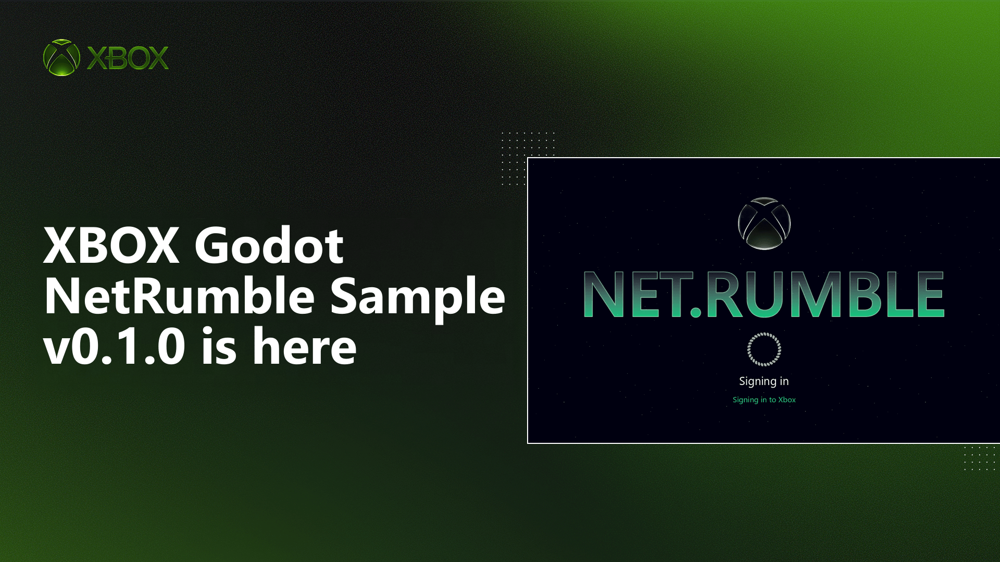

<p align="center">
  <picture>
    <source media="(prefers-color-scheme: dark)" srcset="docs/images/netrumble-banner-dark.png">
    
  </picture>
</p>

[![License: MIT][badge-license]][link-license]
[![Godot 4.6+][badge-godot]][link-godot]
[![Microsoft GDK supported][badge-gdk]][link-gdk]
[![PlayFab supported][badge-playfab]][link-playfab]
[![GameInput supported][badge-gameinput]][link-gameinput]
[![Documentation on Microsoft Learn][badge-docs]][link-docs]
[![Visit our Blog][badge-blog]][link-blog]
[![Join us on Discord][badge-discord]][link-discord]
[![PRs welcome][badge-prs]][link-prs]
[![Join the XBOX Developer Program][badge-devprogram]][link-devprogram]

# XBOX Godot NetRumble

**A complete multiplayer XBOX game, built in Godot 4.** NetRumble is a 2D top-down space
shooter: dodge the asteroids, grab laser, rocket and mine pick-ups, and shoot your friends
for points. Lobby and party voice chat, invites straight from the guide, achievements and a
saved match history, all in the box.

Most platform samples show you one API at a time against a stub. NetRumble wires every
Microsoft **GDK** and **PlayFab** service into the place a shipping title would really call
it, so you can watch sign-in, privileges, privacy, Party networking and account-owned Game Saves
work around an actual game loop, and then go and play the result. It is a working reference,
**not a certified title**.

Built with GDScript and the [XBOX Godot Sample](https://github.com/microsoft/XBOX-Godot-Sample)
GDK/PlayFab addons, pinned as a submodule at `external/xbox-godot-sample` and built into
`addons/`.

> [!IMPORTANT]
> **This is a source-only sample, not a shipping game.** NetRumble is MIT-licensed at the
> game layer; the Microsoft GDK, PlayFab and [XBOX Godot Sample](https://github.com/microsoft/XBOX-Godot-Sample)
> dependencies still require their own installs and license acceptance, consistent with other
> XBOX samples. There is no specified update cadence for support or maintenance. We'll watch
> the repo, monitor issues, and iterate where it makes sense, but this isn't a commercial
> release. We are excited to hear your feedback, and see any community PRs, as we evolve this
> together.
>
> **All gameplay needs an account and ready Game Saves.** Sign-in, Lobby discovery, Party,
> privileges, achievements and Game Save all run against the **XDKS.1** sandbox and title,
> which needs an XBOX publishing relationship and a test account from that sandbox. Without
> it you can still clone, build and inspect the project, but cannot play, including Practice.
> Sign-in or save-loading failures offer **Retry / Back**, not unsaved play. Please join
> the [XBOX Developer Program](https://developer.microsoft.com/en-us/games/) to get access.



---

## What works where

Every platform feature in the sample, and the environments it runs in. This is what the code is
built to do rather than a record of live test results; service availability, title access and
account policy still apply.

| Feature | XBOX on PC | XBOX Series X\|S | Debug desktop custom-ID | Offline |
|---|---|---|---|---|
| XBOX identity → PlayFab authentication | XBOX-linked | XBOX-linked | PlayFab custom-ID only | Platform-dependent; not guaranteed at cold launch |
| PlayFab Lobby discovery + Party transport | Yes, after saves are ready | Yes, after saves are ready | No gameplay; diagnostics only | Unavailable |
| PlayFab Party voice + in-match typed text | Subject to XBOX policy | Subject to XBOX policy | No gameplay | Unavailable |
| XBOX privileges, privacy, string verification, reporting | Yes | Yes | Bypassed / unavailable | Unavailable |
| XBOX friends, activity, invites, recent players | Yes | Yes | Unavailable | Unavailable |
| XBOX achievement reporting | Yes | Yes | No gameplay progress | Same-account counters; service reporting needs connectivity |
| GlobalScore standalone leaderboard | Online-match writes subject to title policy; top-10 reads | Online-match writes subject to title policy; top-10 reads | No gameplay; lower-level API diagnostics only | No submission or cached board; Practice stays local |
| Xbox XGameSaveFiles roaming | Per-account synced folder | Per-account synced folder | Unavailable without a signed-in XboxUser | No cloud sync while disconnected |
| Settings, history and counters | Account-owned Game Saves | Account-owned Game Saves | No save cache or gameplay | Platform-managed account folder only, if ready |
| Lifecycle / controller detection | Focus and device detection | Suspend/resume, constrain, association detection | Desktop behavior | Platform-dependent |

Practice is a local simulation, not an unsigned mode. It requires an identified account and
a successfully initialized/loaded Game Saves folder, including when the platform supports
offline access to that folder. A cold offline launch is not guaranteed to resolve the required
identity and store. PC and console use the same `GameSaveService` / `GDK.game_save`
backend; historical shared or `--pf-user` token files are never read, imported, moved or deleted.

The sample uses **PlayFab Lobby discovery**, not PlayFab Matchmaking queues or tickets.
Voice mute and typed-text privacy are separate. Text is in-match only: four recent messages,
100 characters each, no persistence or scrollback, and no speech-to-text, text-to-speech or
translation. The lobby remains voice-only. See [communication behavior](docs/multiplayer.md#chat).
The game has no host migration or join-in-progress and favors low-latency demonstrations;
these are [sample gameplay limits](docs/multiplayer.md#scope-and-non-goals), not Party limits.

**Known issues:** this sample is still being built and some things are broken, including a
multiplayer bug that can cost you control of your ship in three-player matches, and a hang when
leaving a match that used voice or typed text. See [Known issues](docs/known-issues.md) before
you file a bug.

## Requirements

- **Godot 4.6 or later**, tested with 4.6.2. A standard build is enough; the GDK addons are
  GDExtensions and need no custom engine.
- **Windows**, for the GDK and PlayFab addons to load.
- **Visual Studio 2022** with the vcpkg component, and a **Microsoft GDK** edition. These are
  needed once, to build the addons.
- Exporting to XBOX Series X|S additionally requires GDKX through an NDA XBOX developer
  program, an authorized devkit and a Middleware console fork of Godot. Complete the
  [XBOX Development Kit setup](https://learn.microsoft.com/en-us/gaming/gdk/docs/gdk-dev/console-dev/dev-kits/setup/setting-up-your-devkit?view=gdk-2604)
  first (authorized access required).

The registered-PC path also needs GDK PC tooling (`wdapp`), appropriate export templates,
authorized access to the sample's **XDKS.1** sandbox/title, and an XBOX test account from that
sandbox signed in to the XBOX app. Registration alone does not grant service access.
Check [sandbox/account setup](docs/configuration.md#set-the-sandbox-to-xdks1) before exporting;
changing the sandbox is administrator-only and machine-wide.

New to the GDK or PlayFab? [Before you start](docs/configuration.md#before-you-start) walks the
three provisioning steps in order, marks which you can complete yourself and which need an XBOX
publishing relationship, and lists
[what runs without the full set](docs/configuration.md#what-works-without-the-full-set).

## Quickstart: registered XBOX on PC

`addons/` is build output and is not committed, so a fresh clone has to build it once:

```powershell
git clone --recurse-submodules https://github.com/microsoft/XBOX-Godot-NetRumble.git
cd godot-netrumble
.\tools\sync_addons.ps1
.\tools\deploy-pc.ps1 -Launch
```

Already cloned without `--recurse-submodules`? `tools\sync_addons.ps1` checks the submodule out
itself. The build takes a while the first time, because vcpkg restores the GDK and PlayFab SDKs,
and is only repeated when the pin moves. See [Addon maintenance](docs/addon-maintenance.md).

If PowerShell refuses to run the scripts, see
[running the PowerShell scripts](docs/configuration.md#running-the-powershell-scripts).

`deploy-pc.ps1` exports the `XBOX on PC` preset, verifies loose-package registration in
`wdapp list`, then launches the registered AUMID. The deliverable is `build\_gdk_staging`,
not an executable at the preset's nominal export path. A successful demonstration reaches
the acquire-user screen and then the menu with the signed-in gamertag. If sign-in fails,
read its stage/reason and check registration, sandbox and account access. Save initialization
and loading must also succeed; failures offer **Retry / Back** and block every gameplay path.

Keep the committed sample title/package identifiers unchanged; see the
[configuration checklist](docs/configuration.md#configuration-checklist). Continue with the
[Walkthroughs](docs/walkthroughs.md) to demonstrate identity, joining and services.

### Other run paths

- **Editor exploration:** after addon setup, `godot.exe --path .` (or F5) can inspect the
  front end, but missing identity/save readiness blocks Practice as well as multiplayer.
  An initialized GDK in the editor is **not registered package identity**.
- **Custom-ID diagnostics:** debug `--pf-user` / `--pf-title` overrides can exercise
  authentication against a separate development title. Without a signed-in XboxUser
  they cannot prepare Game Saves or enter gameplay. Use two registered devices/accounts
  for multiplayer; see [testing prerequisites](docs/multiplayer.md#testing-two-players-on-one-pc).
- **Console:** after completing the authorized GDKX and devkit setup, use a Middleware console
  fork and `.\tools\deploy-console.ps1 -Launch`; see
  [configuration](docs/configuration.md#running-with-gdk-identity).

<a id="feature-index"></a>

## What this sample demonstrates

Follow these source boundaries alongside the [Walkthroughs](docs/walkthroughs.md).

| Feature | Source | Guide |
|---|---|---|
| GDK sign-in and the exchange for a PlayFab identity | `scripts/services/identity_service.gd` | [Platform services](docs/platform-services.md#sign-in) |
| Account/save readiness, progress and Retry/Back | `scripts/ui/screens/acquire_user_screen.gd` | [Platform services](docs/platform-services.md#sign-in) |
| PlayFab Party as a drop-in Godot `MultiplayerPeer` | `scripts/services/party_service.gd` | [Multiplayer](docs/multiplayer.md) |
| Join-code discovery with PlayFab Lobby | `scripts/services/party_service.gd` | [Connection flows](docs/multiplayer.md#connection-flows) |
| Multiplayer and communications privilege checks | `scripts/services/privilege_service.gd` | [Platform services](docs/platform-services.md#privileges-and-player-communication) |
| Per-player mute, block and avoid enforcement | `scripts/services/privacy_service.gd`, `scripts/autoload/platform_session.gd` | [Platform services](docs/platform-services.md#privileges-and-player-communication) |
| Text verification before user-authored content is published | `scripts/services/moderation_service.gd` | [Platform services](docs/platform-services.md#moderation-and-reporting) |
| Party voice and four-message typed-text display | `scripts/services/chat_service.gd`, `scripts/ui/elements/nr_chat_log.gd` | [Multiplayer](docs/multiplayer.md#voice-chat) |
| One-shot and incremental achievement progress | `scripts/services/achievement_service.gd`, `scripts/services/achievement_tracker.gd` | [Platform services](docs/platform-services.md#achievements) |
| PC/console Game Saves: account-owned profile, history and counters | `scripts/services/game_save_service.gd` | [Platform services](docs/platform-services.md#game-saves) |
| Standalone leaderboard submission and browsing | `scripts/services/leaderboard_service.gd`, `scripts/ui/screens/leaderboards_screen.gd` | [Leaderboard behavior and client-access policy](docs/leaderboards.md) |
| Suspend, resume and constrain handling | `scripts/main.gd` | [Architecture](docs/architecture.md#process-lifecycle) |
| Activity publishing and join-from-guide invites | `scripts/autoload/platform_session.gd`, `scripts/services/activity_service.gd`, `scripts/autoload/invite_router.gd` | [Multiplayer](docs/multiplayer.md) |
| Connectivity detection before online play is offered | `scripts/services/connectivity_service.gd` | [Architecture](docs/architecture.md#connectivity-detection) |
| Controller association/detection, without input filtering | `scripts/services/device_service.gd`, `scripts/main.gd` | [Platform services](docs/platform-services.md#controller-association) |
| GameInput device tracking behind the GDK user/device APIs | `scripts/services/device_service.gd` | [Platform services](docs/platform-services.md#controller-association) |

`Services` owns the service instances, including **both `PartyService` and `ChatService`**.
`NetManager` consumes that facade for the session; its `PlatformSession` helper maintains
the XBOX view of the session. Small UI adapters also wrap system UI, such as the console keyboard.

## Architecture at a glance

```
XboxBootstrap             GDK runtime bootstrap
Services                  Owns identity, Party, chat, policy, saves and XBOX service wrappers
NetManager → Services     Session, authenticated peer roster and gameplay RPCs
  └── PlatformSession     Activity, presence, recent players, names and communication policy
InviteRouter              Buffers activations until account, saves and front end are ready
main.gd                   Synchronous suspend persistence; resume/constrain and device overlay
```

This is an ownership sketch, not the autoload order; see [architecture](docs/architecture.md#autoload-order).
Match events feed the achievement tracker and saved history; the arena is simply the workload.

The transport is **PlayFab Party**, wrapped by `PlayFabPartyPeer`, a `MultiplayerPeerExtension`,
and therefore a drop-in Godot `MultiplayerPeer`. Every `@rpc` in `net_manager.gd` is ordinary
Godot RPC; only the peer *construction* is PlayFab-specific.

Full detail: [Architecture](docs/architecture.md).

## Documentation

| Page | Contents |
|---|---|
| [Architecture](docs/architecture.md) | Platform ownership, identities, saves, lifecycle and connectivity |
| [Multiplayer](docs/multiplayer.md) | Lobby discovery, Party connection/leave, voice and typed text |
| [Platform services](docs/platform-services.md) | Sign-in, privileges, privacy, moderation, achievements, saves |
| [Leaderboards](docs/leaderboards.md) | The standalone `GlobalScore` board, match submission and client-access policy |
| [Configuration](docs/configuration.md) | Registered-PC setup, sandbox/accounts, fixed title configuration, alternate run paths |
| [Walkthroughs](docs/walkthroughs.md) | Prerequisites → player action → API → observable outcome and failure |
| [XBOX Requirements](docs/xr-compliance.md) | Each XR the sample has code for, and where that code is |
| [Manual test plan](docs/manual-test-plan.md) | Integration acceptance and secondary gameplay regression; record actual results |
| [Addon maintenance](docs/addon-maintenance.md) | Building `addons/` from the submodule, moving the pin, the project's `.gdextension` overrides |
| [Glossary](docs/glossary.md) | Every XBOX, GDK and PlayFab term used in these pages, in one line each |
| [Troubleshooting](docs/troubleshooting.md) | Symptoms you can see, their documented cause and the shortest safe fix |
| [Known issues](docs/known-issues.md) | The bugs we already know about, and which platform each one affects |
| [Repository checks](tools/repository-checks.md) | The CI text gates, what each one enforces and how to run them locally |

**Secondary maintainer references:** [Gameplay](docs/gameplay-reference.md) covers simulation,
physics, tuning and presentation. [Protocol](docs/protocol.md) covers RPCs, snapshots and
reconciliation. Neither is a prerequisite for demonstrating the platform integration.

## Contributing

See [CONTRIBUTING.md](CONTRIBUTING.md). This repository has no automated test suite for gameplay
or netcode, so [docs/manual-test-plan.md](docs/manual-test-plan.md) is the acceptance gate for any
change to the multiplayer core.

- Security issues: [SECURITY.md](SECURITY.md)
- Getting help: [SUPPORT.md](SUPPORT.md)
- Expected conduct: [CODE_OF_CONDUCT.md](CODE_OF_CONDUCT.md)

## Trademarks

This project may contain trademarks or logos for projects, products, or services. Authorized use
of Microsoft trademarks or logos is subject to and must follow
[Microsoft's Trademark & Brand Guidelines](https://www.microsoft.com/en-us/legal/intellectualproperty/trademarks/usage/general).
Use of Microsoft trademarks or logos in modified versions of this project must not cause confusion
or imply Microsoft sponsorship. Any use of third-party trademarks or logos is subject to those
third-party's policies.

[badge-license]: https://img.shields.io/badge/license-MIT-107C10
[link-license]: LICENSE
[badge-godot]: https://img.shields.io/badge/Godot-4.6%2B-478CBF?logo=godotengine&logoColor=white
[link-godot]: https://godotengine.org/
[badge-gdk]: https://img.shields.io/badge/Microsoft%20GDK-%E2%9C%93-107C10
[link-gdk]: https://github.com/microsoft/GDK/releases
[badge-playfab]: https://img.shields.io/badge/PlayFab-%E2%9C%93-107C10
[link-playfab]: docs/platform-services.md
[badge-gameinput]: https://img.shields.io/badge/GameInput-%E2%9C%93-107C10
[link-gameinput]: docs/platform-services.md#controller-association
[badge-docs]: https://img.shields.io/badge/docs-Microsoft%20Learn-0078D4
[link-docs]: https://aka.ms/XBOXGodotDocs
[badge-blog]: https://img.shields.io/badge/Visit%20our-Blog-FFA500?logo=rss&logoColor=white
[link-blog]: https://developer.microsoft.com/en-us/games/articles/
[badge-discord]: https://img.shields.io/badge/Join%20us%20on-Discord-7289DA?logo=discord&logoColor=white
[link-discord]: https://aka.ms/msftgamedevdiscord
[badge-prs]: https://img.shields.io/badge/PRs-welcome-d6336c
[link-prs]: CONTRIBUTING.md
[badge-devprogram]: https://img.shields.io/badge/XBOX%20Developer%20Program-0B5D0B?logo=xbox&logoColor=white
[link-devprogram]: https://developer.microsoft.com/en-us/games/
